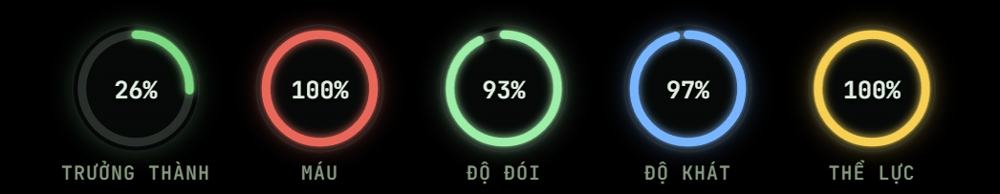

# TheIsleVNHud

> [!IMPORTANT]
> This is the **Anh Em 3 Miền Only** edition branch. Use `main` for the generic
> build without server name or online-player integration.

Customizable Windows in-game HUD for **The Isle**, based on
[reversum/isle-overlay](https://github.com/reversum/isle-overlay).

Vietnamese-first HUD with a persistent in-game overlay, movable widgets,
minimap, live player data, and a smooth location/friend compass. Press `F8` to
open or close the dashboard; the HUD remains visible while you play.

> [!IMPORTANT]
> This repository preserves the upstream Git history and credits the original
> project and author. The upstream repository did not publish a license when it
> was imported, so this project does not claim to relicense that source code.
> See [License and attribution](#license-and-attribution) and
> [THIRD_PARTY_NOTICES.md](THIRD_PARTY_NOTICES.md).

## HUD preview

### Full in-game HUD layout

The minimap, Prime checklist, compass, circular stats, and other HUD widgets stay
visible during gameplay. Open the dashboard with `F8` to drag each widget or
freely change its size and scale.


### Circular health, hunger, thirst, stamina, and growth indicators



### Smooth compass with locations, distances, and friends

The compass displays nearby named locations with distance and also keeps friend
names visible with a `BẠN` marker and their current distance.


## Features

### In-game overlay

- Transparent, click-through Electron overlay that follows the The Isle game
  window, stays above fullscreen/borderless gameplay, and hides when the game is
  not active.
- Steam sign-in through a deep link; the bearer token stays in the Electron main
  process instead of being exposed to the React renderer.
- `F8` opens or closes only the dashboard; enabled HUD widgets remain visible in
  game.
- Draggable and freely resizable widgets for stats, Prime progress,
  heart/health, compass, and radar. Resize handles are shown only while the
  dashboard is open.
- Vietnamese is the default language, with an English/Vietnamese language
  selector for players.
- Developer-controlled server branding and backend endpoint, plus player HUD
  opacity, transparent background, accent/stat colors, streamer mode, and
  compatibility mode.
- Optional server-edition widget for builds that provide a GameMonitoring
  server ID. Generic builds leave this integration disabled.

### Player dashboard and HUD

- Dinosaur identity, species, sex, server, online state, and growth.
- Health, stamina, hunger, thirst, and growth indicators with bar or circular
  layouts.
- Carb, protein, and lipid nutrition tracking.
- Prime/Prime Elder eligibility, completed conditions, and quest checklist.
- Live updates over WebSocket.

### Radar and live map

- Floating radar/minimap with circle or square shape plus configurable size,
  range, and labels.
- Shared Radar/Compass filters for sanctuaries, migration zones, patrol zones,
  other places, and friends.
- Live player position and facing direction.
- Smooth horizontal compass centered at the top of the screen. It shows nearby
  named map locations within 1,500 metres, avoids overlapping labels, caches map
  positions, and interpolates rotation to reduce stutter.
- Friends are always represented on the compass with their name and distance;
  off-screen friends are pinned to the nearest compass edge.
- Full live map with named locations, category filters, and food spawn markers.

### Skin tools

- Live skin color editor for body, belly, detail, detail-2, eye, and eye-ring
  zones.
- Save, load, update, delete, reset, and randomize skin presets.
- Animated 3D dinosaur preview with pattern, texture, normal-map, juvenile, and
  glitched-skin rendering support.
- Skin shop view for available and owned skins.

### Garage and shops

- View parked dinosaurs and their vitals, growth, Prime status, and palette.
- Park, restore/live-swap, sell, rename, or slay dinosaurs when enabled by the
  server.
- Mutation selection where supported.
- Dinosaur and skin storefronts with balance, purchase, ownership, and equip
  actions supplied by the backend.

### Support and administration

- Support ticket inbox, unread/urgent indicators, and support desk views.
- Online admin status and admin availability controls.
- Server-driven media/audio overlay events.
- Admin-only map editor with mesh/blueprint catalogs, favorites and recent
  assets, player/look/XYZ placement, transforms, spawn, focus, bring, teleport,
  and delete operations.

### Desktop delivery

- Windows x64 NSIS installer.
- In-app update checks backed by this repository's GitHub Releases.
- GitHub Actions validation on pushes and pull requests.
- Automatic GitHub Release assets for version tags such as `v0.4.0`.

## Backend requirement

This is the desktop client from the upstream IslePilot ecosystem. By default it
connects to `https://islepilot.eu` and expects compatible Steam authentication,
HTTP API, WebSocket, map, shop, garage, skin, support, and admin endpoints.

The UI can be built independently, but backend-powered features will not work on
another server until you provide compatible services or customize the API and
authentication integration.

## Technology

- Electron main process and Windows native integration (`electron/`).
- React + TypeScript renderer bundled with Vite (`src/`).
- Three.js / React Three Fiber skin preview.
- Static map-editor catalogs in `resources/`.
- `electron-builder` Windows installer packaging.

## Development

Requirements: Windows, Node.js 22, and npm.

```powershell
npm ci
npm run dev
npm run typecheck
```

### Build defaults

Edit `build.config.json` before packaging to customize the defaults used by a
fresh installation:

- `serverName` and `overlayLabel` control the window title and bottom-right badge.
- `apiBaseUrl` selects the compatible backend.
- `language` accepts `en` or `vi`.
- `statsStyle` accepts `bars` or `circles`.
- `dashKey`, `radarShape`, and `accentColor` set their initial values.
- `gameMonitoringServerId` is `null` in the generic configuration, which hides
  the server-status widget and prevents GameMonitoring requests.
- `defaultUserSettings` contains the sanitized default widget layout, scale,
  visibility, minimap, transparency, and visual settings used by a fresh
  installation.

The committed default layout is copied from the maintainer's current HUD
configuration. Authentication fields (`steamId` and `overlayToken`) and the
machine-specific detached radar window position are deliberately never stored
in source control.

Server branding and backend values are developer-only build settings and are not
shown in the installed app. Users can override language, HUD style, hotkeys,
radar, and colors from the in-app Settings panel. The build language is used
until the user explicitly selects English or Vietnamese; that choice is then
remembered.

### Server editions

The committed `build.config.json` on `main` is generic and deliberately contains
no GameMonitoring server ID. Server-specific configuration is maintained on a
separate edition branch instead of being embedded in generic releases.

The `ae3mien` branch uses GameMonitoring server ID `14040695`. It displays the
full server name, online/offline state, player count, and slot limit. The client
polls every 60 seconds, but
GameMonitoring supplies monitored snapshots rather than a realtime stream, so
the displayed count can lag behind the game by several minutes.

Build the Windows installer locally:

```powershell
npm run dist -- --publish never
```

The installer is written to `release/TheIsleVNHud-<version>-Setup.exe`.

## GitHub Actions releases

Every push and pull request runs the generic Windows build and uploads the
installer as a workflow artifact. To create a generic GitHub Release:

```powershell
npm version patch
git push origin main --follow-tags
```

The pushed `v*` tag must match the version in `package.json`. The workflow then
creates the GitHub Release and attaches the `.exe`, update metadata, and
blockmap. You can also run the workflow manually to produce a downloadable
Actions artifact without publishing a Release.

AE3Miền-only releases are created from the `ae3mien` branch with a tag such as
`v0.5.1-ae3mien.1`. That branch builds the separate `ae3mien` updater channel,
marks the GitHub Release as a pre-release, and labels it **Anh Em 3 Miền Only**.
Generic releases never receive that server ID or widget.

Server-specific development is maintained on the `ae3mien` branch. The `main`
branch remains the generic edition with `gameMonitoringServerId: null`; the
`ae3mien` branch enables the AE3Miền server ID and updater channel directly.

## Syncing upstream

The upstream remote is configured in the local clone:

```powershell
git fetch upstream
git merge upstream/main
```

Review conflicts carefully so custom branding and backend changes are not lost.

## License and attribution

Original project: [reversum/isle-overlay](https://github.com/reversum/isle-overlay)  
Original source author/credit: **Yannik F / YannikAufDie1 / reversum**  
Imported upstream commit: `fe7eb0c7f95258b7d7a13694d08629aaed37a5f4`

At import time, the upstream repository had no `LICENSE` file, no package
license declaration, and no GitHub-detected license. Copyright therefore remains
with the respective authors, and no open-source license is implied. The notice
in [LICENSE](LICENSE) records this status; it is not a substitute for permission
from the upstream copyright holder.

Custom changes and repository maintenance are credited to
[TheIsleAE3Mien](https://github.com/TheIsleAE3Mien). Upstream attribution must be
kept in redistributions and derivative versions.

## Credits

- [reversum/isle-overlay](https://github.com/reversum/isle-overlay) — original
  application, architecture, UI, and source code.
- **Yannik F / YannikAufDie1** — original author named in the upstream commit and
  package metadata.
- [TheIsleAE3Mien](https://github.com/TheIsleAE3Mien) — customization,
  repository maintenance, and release automation.
